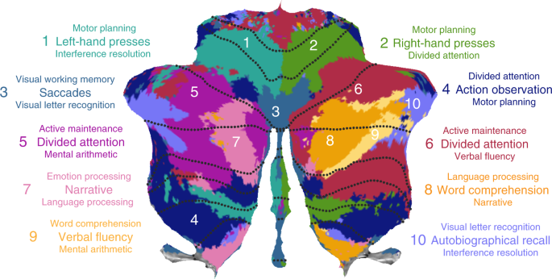

Dataset and Import Module
=========================

The atlas module of the SUIT toolbox contains functions that download cerebellar atlases and contrast images from online open-source repositories (e.g., King et al., 2019; Ji et al., 2019). Both nifti and gifti files are downloaded but note that gifti files should be used for visualization purposes only.

.. toctree::
   :maxdepth: 2

   notebooks/datasets_example

For details on cerebellar projects currently included, see:

* King, M., Hernandez-Castillo, C.R., Poldrack, R.R., Ivry, R., and Diedrichsen, J. (2019). Functional Boundaries in the Human Cerebellum revealed by a Multi-Domain Task Battery. Nat. Neurosci.
* Buckner, R. L., Krienen, F. M., Castellanos, A., Diaz, J. C. & Yeo, B. T. (2011). The organization of the human cerebellum estimated by intrinsic functional connectivity. J Neurophysiol 106, 2322–2345
* Ji, J. L., Spronk, M., Kulkarni, K., Repovš, G., Anticevic, A., & Cole, M. W. (2019). Mapping the human brain's cortical-subcortical functional network organization. Neuroimage, 185, 35-57
* Xue, A., Kong, R., Yang, Q., Eldaief, M. C., Angeli, P. A., Dinicola, L. M., … Yeo, B. T. T. (2021). The detailed organization of the human cerebellum estimated by intrinsic functional connectivity within the individual. https://doi.org/10.1152/jn.00561.2020
* Diedrichsen, J., Balsters, J. H., Flavell, J., Cussans, E., & Ramnani, N. (2009). A probabilistic atlas of the human cerebellum. Neuroimage.
* Diedrichsen, J., Maderwald, S., Kuper, M., Thurling, M., Rabe, K., Gizewski, E. R., et al. (2011). Imaging the deep cerebellar nuclei: A probabilistic atlas and normalization procedure. Neuroimage.

