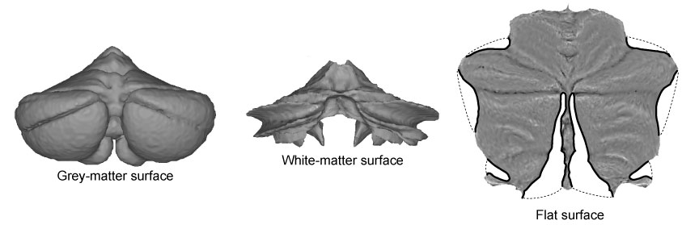
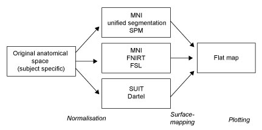

Flatmap Module
==============

The flatmap module of the SUIT toolbox contains a flat representation of the human cerebellum that can be used to visualise imaging data after volume-based normalisation and averaging across subjects. The method uses an approximate outer (grey-matter) and inner (white-matter) surface defined on the SUIT template (see figure below). Functional data between these two surfaces is projected to the surface along the lines connecting corresponding vertices. By applying cuts (thick black lines) the surface could be flattened out. We aimed to retain a roughly proportional relationship between the surface area of the 2D-representation and the volume of the underlying cerebellar grey matter. The map allows users to visualise the activation state of the complete cerebellar grey matter in one concise view, equally revealing both the anterior-posterior (lobular) and medial-lateral organisation.

The surface representation of the cerebellum is a group surface, designed to display functional data that has been averaged across participants in volumetric group space. The first step is a normalization of the data into a group space, either the SUIT space (using the Matlab version of the SUIT toolbox) or MNI space (we recommend FSL's FNIRT function).

Using the flatmap involves two step: Mapping the data from volume space to the flatmap, followed by plotting the data. 

.. toctree::
   :maxdepth: 2

   notebooks/flatmap_example

For more details, see:

* Diedrichsen, J. & Zotow, E. (2015). Surface-based display of volume-averaged cerebellar data. PLoS One, 7, e0133402 (http://www.diedrichsenlab.org/pubs/PlosOne_flatmap_2015.pdf).
* Video: https://www.youtube.com/watch?v=LipA4B73z-w&feature=youtu.be

Did you know?
-------------
We also have an online version of our cerebellar atlases. Check it out at http://www.diedrichsenlab.org/imaging/AtlasViewer/index.htm.
