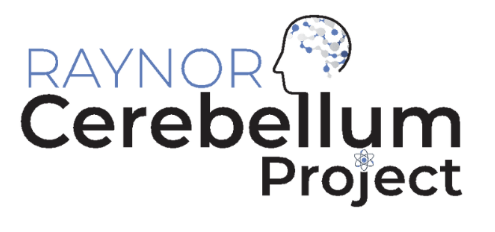

.. SUITPy documentation master file

SUITPy Documentation
====================
SUITPy is a Python toolbox for the analysis of imaging data from the human cerebellum. With the new version 2 release it will have most of the functionality of the SUIT toolbox for Matlab (https://github.com/jdiedrichsen/suit).
The newest developments will be implemented in the Python version.

.. toctree::
   :maxdepth: 1
   :caption: Contents:

   install.rst
   isolate.rst
   normalize.rst
   reslice.rst
   flatmap.rst
   atlases.rst
   reference.rst

Important links
---------------

- SUIT website: http://diedrichsenlab.org/imaging/suit.htm
- Repository of the Python version: https://github.com/diedrichsenlab/SUITPy
- Repository of the Matlab version: https://github.com/jdiedrichsen/SUIT

Acknowledgements
----------------
SUITPy is developed by the Diedrichsenlab and collaborators, including
Carlos Hernandez-Castillo, Yao Li, Yaping Wang, Bassel Arafat, Caroline Nettekoven, Ladan Shahshahani, Da Zhi, Maedbh King, Jorn Diedrichsen, and many others.

Funding for this work was provided by:

Indices and tables
------------------

* :ref:`genindex`
* :ref:`modindex`
* :ref:`search`
