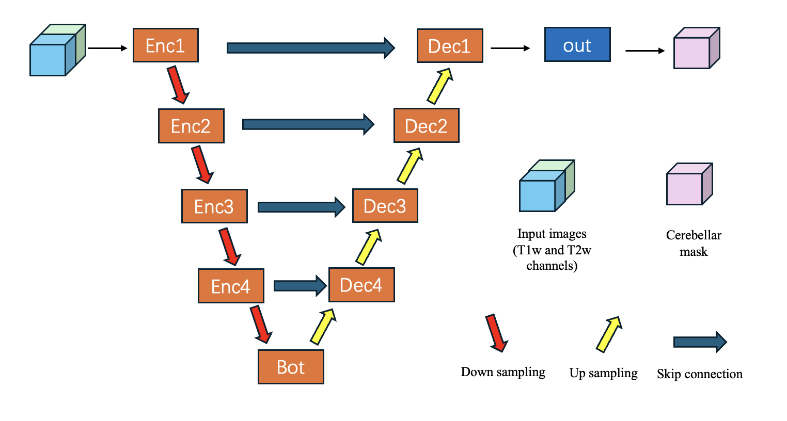

Isolation Module
================

The isolation module of the SUIT toolbox uses a pre-trained convolutional neural network to isolate the cerebellum and brainstem from the rest of the head. The network was trained on manually labelled anatomical images from a wide range of studies, scanners and acquisition protocols. The network is based on the U-Net architecture and implemented using the Pytorch package. The network was developed by Yao Li with supervision from Carlos Hernandez-Castillo and Jörn Diedrichsen.

architecture
----------
Here is the overall Unet architecture

The model takes 2 input channels which are filled with T1w and T2w images respectively. 0 padding is used if any input channel is empty. The model would work on any single modality input (T1w/T2w) and have better performance when both modalities are provided.

prerequisite
--------
If T1w and T2w images are fed, two images must be aligned.

Usage
----------

There are two ways to use the module

1. Import the isolate function from the SUITpy library and use directly (recommended)

.. toctree::
   :maxdepth: 2

   notebooks/isolate_example

2. Alternatively, you can run the script directly via the terminal or bash script. 
::
    python isolate.py --T1 T1w_image

There are also other parameters available. Use the following command to see the details
::
    python isolate.py -help

