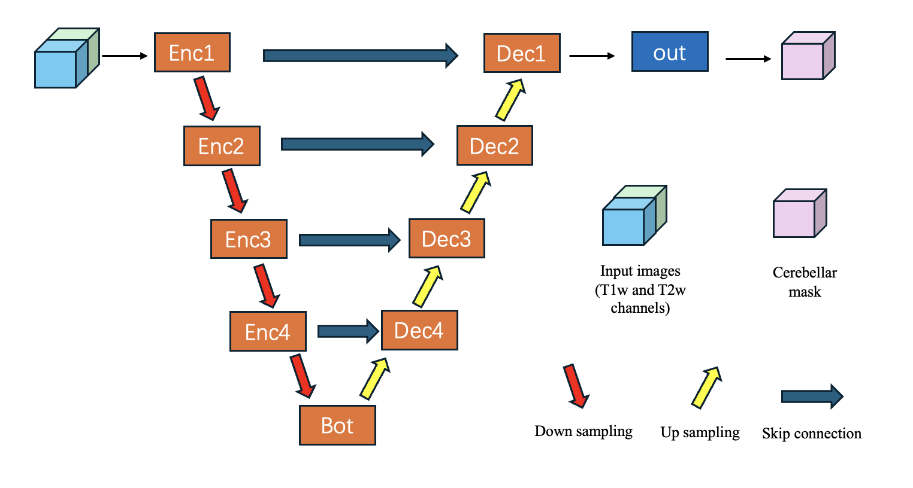

Isolation Module
================

The isolation module of the SUIT toolbox uses a pre-trained convolutional neural network to isolate the cerebellum and brainstem from the rest of the head. The network was trained on manually labelled anatomical images from a wide range of studies, scanners and acquisition protocols. It works more reliably and accurately than previous (Matlab) versions of the SUIT toolbox.
The network is based on the U-Net architecture and implemented using the Pytorch package. The network was developed by Yao Li with supervision from Carlos Hernandez-Castillo and Jörn Diedrichsen.

------------------------------

You can directly import the isolate function from the SUITpy package and use in python code (recommended)

.. toctree::
   :maxdepth: 2

   notebooks/isolate_example

Use isolate from terminal or bash script
----------------------------------------

You can run the script directly via the terminal or bash script.

.. code::

    python isolate.py --T1 T1w_image

The optional input parameters are

.. code::

    --T1: T1w- image
    --T2: Additional (or standalone T2w image)
    --result_folder dir:
    --brain_mask Mask_image: Binary mask image from skull stripping step to improve affine normalization
    --template template: Templa] [--params PARAMS] [--save_cropped_files] [--save_transform]

Architecture
------------

The model then has a classic U-Net architecture with 4 layers depth.
It takes 2 input channels which are filled with T1w and T2w images respectively. 0 padding is used if any input channel is empty.
The model works well on any single modality input (T1w/T2w) and has better performance when both modalities are provided.
If T1w and T2w images are fed, two images must be co-registered to each other.