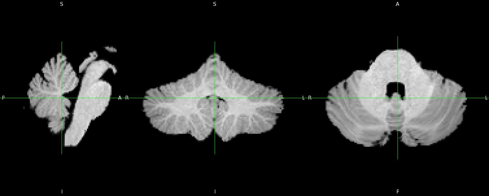
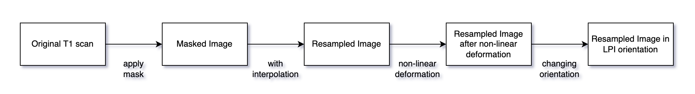

Reslice Module
==============

The reslice module of the SUIT toolbox uses the flowfield and affine transformation found by normalization module to bring images into Atlas space. The method uses a mask to T1 scan image and then sampling the masked image with nearest interpolation or trilinear interpolation. Then, applying non-linear deformation to the resampled image. Finally, changing the image from RAS orientation to LPI orientation.

The first step is to apply a mask to T1 scan image. Then, resample the masked image with nearest neighbour or trilinear interpolation. After that, applying non-linear deformation to the resampled image. Finally, changing the image orientation from RAS to LPI.

.. toctree::

    notebooks/reslice_example
